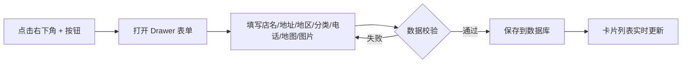
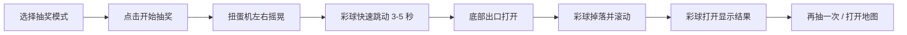

# 饭好（FanHao）产品需求文档

## 1. 产品概述

饭好是一个面向家庭、朋友小圈子的餐厅记录与随机推荐单页应用。用户可以记录「吃过」的餐厅，并在不知道吃什么时通过「食咩」扭蛋机随机抽取一家餐厅。

产品核心目标是让餐厅管理变得轻松有趣，同时通过富有仪式感的抽奖动画，解决「今天吃什么」的日常决策疲劳。

## 2. 核心功能

### 2.1 功能模块

整个应用为单页应用（SPA），仅有一个页面，分为两个核心模块：

1. **食过**：餐厅管理模块，支持新增、编辑、删除餐厅，管理分类，按店名/分类/地区搜索。
2. **食咩**：随机抽奖模块，通过扭蛋机动画从全部/分类/地区中随机抽取一家餐厅。

### 2.2 页面详情

| 页面名称 | 模块名称 | 功能描述 |
|---------|---------|---------|
| 首页 | 食过 | 餐厅卡片列表、搜索框、分类管理、新增/编辑/删除餐厅 |
| 首页 | 食咩 | 扭蛋机动画、三种抽奖模式、结果展示、再抽一次/打开地图 |

## 3. 核心流程

### 3.1 记录餐厅流程

### 3.2 抽奖流程

## 4. 用户界面设计

### 4.1 设计风格

- **整体方向**：极简、温润、有仪式感。参考 Apple、Notion、Linear 的留白与圆角处理。
- **主色调**：以温暖的 `stone` / `zinc` 中性色为底，搭配低饱和的 `terracotta`（赤陶橙）作为食物主题强调色。
- **辅助色**：柔和的 `sage`（鼠尾草绿）用于成功状态与次要强调。
- **按钮风格**：大圆角胶囊按钮，带细腻 hover 过渡与阴影。
- **字体**：中文使用系统字体 `PingFang SC` / `Microsoft YaHei` 作为正文，标题使用 `Noto Serif SC` 增加精致感；西文使用系统无衬线字体。
- **图标**：使用 `lucide-react` 线性图标，保持纤细、统一。
- **质感**：毛玻璃（backdrop-blur）、柔和阴影、1px 细边框、充足留白。

### 4.2 页面设计概述

| 页面名称 | 模块名称 | UI 元素 |
|---------|---------|---------|
| 首页 | 顶部 Hero | 品牌名「饭好」、简短 slogan、模块切换入口 |
| 首页 | 食过 | 搜索框、分类标签栏、餐厅卡片网格、右下角悬浮 + 按钮 |
| 首页 | 食咩 | 模式选择（全部/分类/地区）、扭蛋机视觉、抽奖按钮、结果弹窗 |

### 4.3 响应式策略

- **桌面端**：两列模块并排或垂直堆叠，卡片网格 3 列，扭蛋机宽度 400px 左右。
- **平板**：卡片网格 2 列，扭蛋机宽度自适应。
- **手机**：单列布局，Drawer 占满屏幕底部，扭蛋机占满宽度。

### 4.4 动画要求

- **页面加载**：模块依次淡入上浮，带轻微 stagger。
- **卡片 hover**：轻微上浮（translateY -4px）与阴影加深。
- **抽奖动画**：
  1. 点击后按钮禁用，扭蛋机容器轻微左右摇晃（shake）。
  2. 透明球体内多个彩球上下快速跳动（bounce）。
  3. 3-5 秒后底部舱门打开，一个彩球掉落。
  4. 彩球沿弧线滚出并停下，随后弹开显示餐厅信息。
  5. 使用 Framer Motion 编排关键帧，CSS transition 处理 hover。

## 5. 数据需求

### 5.1 餐厅字段

- `id`：唯一标识
- `name`：店名（必填）
- `address`：地址
- `regionId`：地区 ID（四级结构末级）
- `categoryId`：分类 ID
- `phone`：联系电话
- `mapUrl`：地图链接
- `imageUrl`：图片链接（可选）
- `createdAt` / `updatedAt`：时间戳

### 5.2 地区结构

四级树形结构，例如：广东 → 佛山 → 顺德 → 伦教。

- `Region` 表：id, name, parentId（自关联），level（1-4）

### 5.3 分类结构

- `Category` 表：id, name, sortOrder

用户可新增、修改、删除分类，每家餐厅只属于一个分类。

## 6. 非功能需求

- **性能**：首屏加载快速，动画 60fps。
- **可维护性**：组件拆分清晰，类型完整。
- **可扩展性**：预留 AI 推荐、吃饭次数排行、登录、多家庭共享、地图定位、统计分析等扩展接口。
- **环境**：开发使用 SQLite，后续可切换至 PostgreSQL / MySQL。
