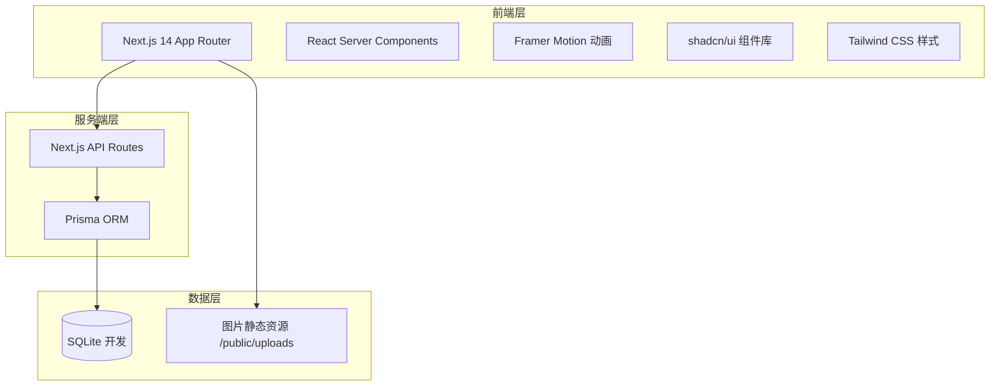
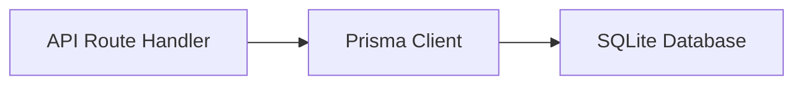
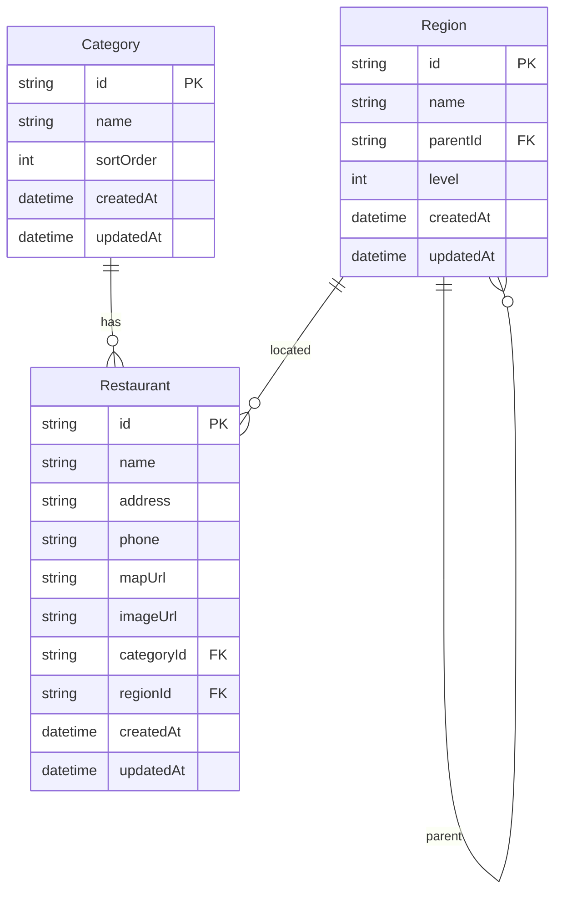

# 饭好（FanHao）技术架构文档

## 1. 架构设计



## 2. 技术描述

- **前端框架**：Next.js 14（App Router）+ React 18 + TypeScript
- **样式方案**：Tailwind CSS 3 + shadcn/ui 组件库
- **动画库**：Framer Motion
- **图标库**：lucide-react
- **ORM**：Prisma
- **数据库**：SQLite（开发环境），后续可通过修改 `DATABASE_URL` 切换至 PostgreSQL / MySQL
- **状态管理**：React useState/useContext 处理本地 UI 状态，服务端数据通过 Prisma 直接查询/更新
- **文件上传**：图片上传至 `public/uploads`，数据库存储相对路径

## 3. 路由定义

| 路由 | 用途 |
|-----|------|
| `/` | 首页，包含食过与食咩两个模块 |
| `/api/restaurants` | 餐厅 CRUD API |
| `/api/categories` | 分类 CRUD API |
| `/api/regions` | 地区树形数据 API |
| `/api/upload` | 图片上传 API |

## 4. API 定义

### 4.1 餐厅 API

```typescript
// GET /api/restaurants
// 返回 Restaurant[]

// POST /api/restaurants
interface CreateRestaurantRequest {
  name: string;
  address?: string;
  regionId?: string;
  categoryId?: string;
  phone?: string;
  mapUrl?: string;
  imageUrl?: string;
}

// PATCH /api/restaurants/:id
interface UpdateRestaurantRequest extends Partial<CreateRestaurantRequest> {}

// DELETE /api/restaurants/:id
```

### 4.2 分类 API

```typescript
// GET /api/categories
// POST /api/categories { name: string }
// PATCH /api/categories/:id { name: string }
// DELETE /api/categories/:id
```

### 4.3 地区 API

```typescript
// GET /api/regions?parentId=xxx
// 返回当前层级的 Region[]
```

## 5. 服务端架构



- API 路由直接使用 Prisma Client 进行数据库操作，保持简单。
- 不引入额外 Service / Repository 抽象层，以控制项目复杂度。

## 6. 数据模型

### 6.1 ER 图



### 6.2 Prisma Schema

```prisma
model Category {
  id        String   @id @default(uuid())
  name      String
  sortOrder Int      @default(0)
  createdAt DateTime @default(now())
  updatedAt DateTime @updatedAt
  restaurants Restaurant[]
}

model Region {
  id        String   @id @default(uuid())
  name      String
  parentId  String?
  level     Int
  parent    Region?  @relation("RegionTree", fields: [parentId], references: [id])
  children  Region[] @relation("RegionTree")
  restaurants Restaurant[]
  createdAt DateTime @default(now())
  updatedAt DateTime @updatedAt
}

model Restaurant {
  id        String   @id @default(uuid())
  name      String
  address   String?
  phone     String?
  mapUrl    String?
  imageUrl  String?
  categoryId String?
  regionId  String?
  category  Category? @relation(fields: [categoryId], references: [id])
  region    Region?  @relation(fields: [regionId], references: [id])
  createdAt DateTime @default(now())
  updatedAt DateTime @updatedAt
}
```

### 6.3 种子数据

初始化时写入示例地区（广东 → 佛山 → 顺德 → 伦教）与分类（寿司、烧烤、火锅、家常菜、奶茶、咖啡）。

## 7. 项目结构

```
饭好/
├── app/
│   ├── api/
│   │   ├── categories/
│   │   ├── regions/
│   │   ├── restaurants/
│   │   └── upload/
│   ├── page.tsx              # 首页
│   ├── layout.tsx            # 根布局
│   └── globals.css           # 全局样式
├── components/
│   ├── ui/                   # shadcn/ui 组件
│   ├── restaurant/           # 餐厅相关组件
│   ├── gacha/                # 扭蛋机组件
│   └── shared/               # 通用组件
├── lib/
│   ├── prisma.ts             # Prisma 单例
│   └── utils.ts              # 工具函数
├── prisma/
│   ├── schema.prisma
│   └── seed.ts
├── public/
│   └── uploads/              # 上传图片
├── types/
│   └── index.ts              # 共享类型
└── next.config.js
```

## 8. 扩展预留

- **AI 推荐**：后续可在 `/api/recommend` 接入 LLM，根据历史记录与偏好推荐餐厅。
- **吃饭次数排行**：在 `Restaurant` 模型增加 `visitCount` 字段。
- **登录系统**：引入 NextAuth.js 或 Clerk。
- **多家庭共享**：新增 `Family` / `Membership` 模型。
- **地图定位**：`mapUrl` 字段已预留，可扩展为经纬度。
- **统计分析**：基于 `visitCount` 与分类/地区维度聚合数据。
